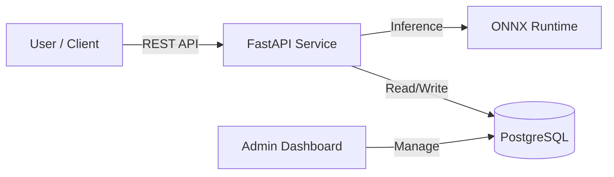

# Soft Robot Control AI Service 🤖


> **End-to-End AI Microservice:** From PyTorch training to Cloud-Native deployment.

This project implements a production-grade AI microservice for controlling soft robotic manipulators. It utilizes a hybrid **Attention-LSTM** architecture to predict end-effector coordinates based on cable length inputs, featuring a complete **Data Flywheel** with automated persistence.

## 📸 Dashboard Preview

*(The system automatically records every inference request into the database for future retraining)*


## 🏗 Architecture

The system follows a **Cloud-Native Microservice** architecture:


# Workflow:
- **Local Dev**: Developed on Mac (ARM64).
- **CI/CD**: GitHub Actions automatically builds multi-arch Docker images.
- **Production**: Deployed on AWS EC2 via Docker Compose orchestration.

# 🚀 Key Features
⚡️ **High Performance**: <15ms latency using ONNX Runtime optimization.

🐳 **Containerized**: Multi-stage Docker build optimized for resource-constrained environments (90% size reduction).

💾 **Data Persistence**: Integrated PostgreSQL to record all inputs/outputs for MLOps loop.

👀 **Observability**: Built-in Adminer dashboard for real-time database management.

🤖 **Automated**: Full CI/CD pipeline handles testing, building, and deployment on every push.

# 🛠 Quick Start
Prerequisites: `Docker` and `Docker Compose` installed.

## 1. Clone & Run

```Bash
git clone [https://github.com/FrankYuDang/soft-robot-control.git](https://github.com/FrankYuDang/soft-robot-control.git)
cd soft-robot-control

# Start the full stack (API + Database + Dashboard)
docker-compose up --build
```

## 2. Access the System
Once running, access the following endpoints:

**API Documentation (Swagger UI)**: http://localhost:8000/docs

Try the POST /predict endpoint to see the AI in action.

**Database Dashboard (Adminer)**: http://localhost:8080

System: PostgreSQL | Server: db | User: user | Pass: password

## 📂 Project Structure
```
├── src/            # Application Source Code
│   ├── app.py      # FastAPI Entrypoint
│   ├── models/     # Database Schemas (SQLAlchemy)
│   └── ...
├── scripts/        # Offline Tasks (Training, ONNX Export)
├── data/           # Model Weights & Datasets
├── docker-compose.yml # Local Orchestration
└── Dockerfile      # Container Definition
```